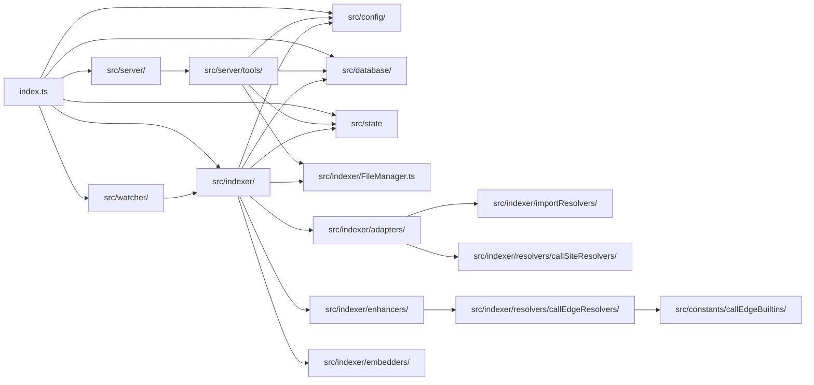

# Agent Guidance: Agentic Indexer MCP

Welcome! This file provides critical context, design principles, architecture overviews, and instructions for AI agents working on or extending this repository.

---

## 🌟 Overview & Architecture

Agentic Indexer indexes codebases at a symbol level, making it easy for AI agents to locate definitions, find imports, construct call graphs, and understand type systems without blowing past context limits by loading raw source files. It registers **29 MCP tools** over `stdio` and runs incrementally by watching files using `chokidar`.

The codebase operates across the following directories:



### Key Folders & Responsibilities

- [index.ts]: Main CLI entry point. Parses commands (`serve`, `index`, `enhance`, `query`, etc.).
- [src/config/]: Configuration loader, defaults, schema types.
- [src/database/]: SQLite database storage layer using Drizzle ORM and `sqlite-vec` for vector operations.
  - [IndexerDB.ts]: Singleton connection manager that initiates database connections, loads extensions, and applies migrations at startup.
  - [repositories/]: Database access layer for symbols, files, and embeddings.
- [src/indexer/]: Parser pipeline orchestration.
  - [adapters/]: Tree-sitter parsers for specific programming languages (e.g., `PythonAdapter`, `TypescriptAdapter`).
  - [enhancers/]: Type resolution, call site linkage, and structural analysis.
  - [resolvers/importResolver/]: Resolves imports for different languages.
  - [resolvers/callSiteResolvers/]: Resolves call sites for different languages.
  - [resolvers/callEdgeResolvers/]: Resolves call edges for different languages.
  - [embedders/]: Generates embeddings for symbols using AI providers.
  - [docstrings/]: Extracts and generates (using AI providers) docstrings and comments for symbols.
  - [FileManager.ts]: Exposes `isPathIgnored`, which checks if a file path is ignored based on `.gitignore` and `indexer.ignore` rules.
- [src/server/]: MCP Server instantiation and standard IO transport logic.
  - [tools/]: Declarations and handler logic for each registered MCP tool.
- [src/watcher/]: Incrementally re-indexes files on save/change.
- [src/state/]: Maintains in-memory app state for the application.

---

## 🛠️ MCP Tool Registration

Each tool is declared in its own file in [src/server/tools/] and registered via [src/server/tools/index.ts].

### Adding a New Tool

1. Create a new tool file: `src/server/tools/my_new_tool.ts`.
2. Define the schema using `Type` or `zod` and call `server.tool()`:

   ```typescript
   import type { McpServer } from '@modelcontextprotocol/sdk/server/mcp.js'
   import { Type } from '@sinclair/typebox'

   export function registerMyNewTool(server: McpServer) {
     server.tool(
       'my_new_tool',
       {
         param: Type.String({ description: 'A parameter description' }),
       },
       async ({ param }) => {
         // Tool logic here
         return {
           content: [{ type: 'text', text: `Result: ${param}` }],
         }
       },
     )
   }
   ```

3. Register it inside [src/server/tools/index.ts].

---

## 🔌 AST Adapters & Language Support

AST extraction is done using `web-tree-sitter`. To add support for a new language:

1. Write the `query.scm` file for the language in [src/indexer/queries/{language}/tags.scm]. This file defines the Tree-sitter query patterns for classes, functions, calls, imports, exports, exceptions, env variables, and docstrings, and should follow the structure of existing query files for other languages.
2. Create an adapter in [src/indexer/adapters/] inheriting from `LanguageAdapter`.
3. Map the AST node patterns matching classes, functions, calls, imports, and exports for that language in the adapter.
4. Create an import resolver inheriting from `ImportResolver` for the language in [src/indexer/importResolver/] to resolve imports and re-exports (if the language supports them) using the language compiler itself.
5. Create a call site resolver inheriting from `GenericCallSiteResolver` for the language in [src/indexer/resolvers/callSiteResolvers/] to resolve call sites and link them to their definitions.
6. Create a list of built-in functions for the language in [src/constants/callEdgeBuiltins/] to resolve call edges for built-in functions and link them to their definitions.
7. Create a call edge resolver inheriting from `GenericCallEdgeResolver` for the language in [src/indexer/resolvers/callEdgeResolvers/] to resolve call edges and link them to their definitions.
8. Create an enhancer inheriting from `GenericLSPEnhancer` for the language in [src/indexer/enhancers/] to resolve types, link call sites, and perform structural analysis. The GenericLSPEnhancer was created with TypeScript in mind, so any language specific quirks will need to be implemented in the language's enhancer.
9. Update `loadEnhancerForFileType` in [src/indexer/IndexPipeline.ts] with the new enhancer, link adapater to the import resolver and register the new adapter in [src/indexer/steps/s1_symbol_extractor.ts].

---

## 💾 Database Schema & Migrations

We use **Drizzle ORM** with **SQLite**.

- The schemas are located in [src/database/schemas/].
- Migrations are saved under [drizzle_migrations/].
- `IndexerDB.init()` applies migrations automatically when starting.

If you modify database schemas:

1. Make your changes in the schema files.
2. Generate the migrations by running:
   ```bash
   bunx drizzle-kit generate
   ```
3. Ensure the repositories in [src/database/repositories/] are updated to reflect the schema changes.

---

## 🧪 Testing

The tests are written using Bun's native test runner (`bun test`) and are located in the [tests/](/tests/) directory.

- Running tests:
  ```bash
  bun run test
  ```
- Running linter:
  ```bash
  bun run lint
  ```

> [!WARNING]
> Before submitting changes, always run the linter and tests to make sure there are no compiler errors or broken functionality.

---

## ⚠️ Important Rules for AI Agents

1. **Path Resolution:** Always use the `resolvePath` or `resolveWorkspacePath` utility from [src/utils/paths.ts] when dealing with file/directory paths. This ensures compatibility when paths are relative to the target workspace or the indexer project home.
2. **Environment Variables:** Do not hardcode configurations. Read them from `process.env`. If a key is required, document it in `.env` and `.env.test`.
3. **Preserve Docstrings:** When editing files, maintain existing JSDoc/TSDoc headers and comments unless explicitly directed to change them.
4. **Clean Code & Modularity:** Keep MCP tool handlers slim. Keep business logic separated in repositories, adapters, or enhancers.
5. **Bun Project**: This is a Bun project. Do not use npm or yarn. Use bun instead.
6. **if not (condition) instead of nested if (condition)**: Use the early return principle unless absolutely necessary. So, instead of if (x) {something}, use if not (x) {return} then do something.
7. **Code Repetition**: Before writing any new feature or functionality, ensure that the same cannot be done by inbuilt methods of Bun or any other library used in the project, AND that you are not repeating any existing code. If you are, refactor and use the existing code.
8. **Test your code**: Always write test cases for the new feature or functionality you are adding.
